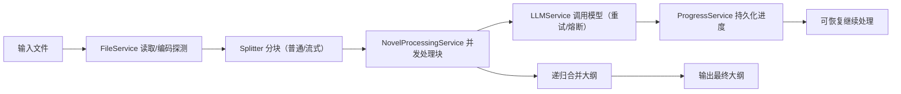

## 小说大纲生成工具

支持命令行、Web 与桌面 GUI，使用 LLM 大模型自动分块、生成和合并大纲。

## 功能概览
- **多模型支持**：OpenAI / 智谱 / Gemini / AiHubMix，支持代理、中转URL
- **智能分块**：按章节/段落/Token数量自动分块
- **递归合并**：逐块生成大纲，递归合并为完整总纲
- **进度追踪**：实时 ETA 估算、合并进度显示
- **Web UI**：上传文件、查看进度与日志、查看环境配置
- **桌面 GUI**：本地窗口化操作，支持文件选择、进度展示、配置编辑与日志查看
- **断点恢复**：支持失败重试、中断恢复
- **代码质量**：Ruff、Black、Mypy 自动检查

## 核心流程图



## 环境准备

### 1. 安装 Python 和 uv
- Python 3.10+（推荐 3.11+）
- 安装 [uv](https://github.com/astral-sh/uv)：
```bash
pip install uv
```

### 2. 创建虚拟环境并安装依赖
```bash
# 创建虚拟环境
uv venv

# 激活虚拟环境（Windows）
.venv\Scripts\activate

# 激活虚拟环境（Linux/Mac）
source .venv/bin/activate

# 安装项目依赖
uv pip install -e ".[dev]"
```

### 3. 配置环境变量

**方式一：自动生成（推荐）**

首次运行时程序会自动检测并创建 `.env` 文件模板。

**方式二：手动编辑**
复制`.env.sample` 为 `.env` 文件并填入配置：

```.env.sample
# API提供商选择: openai, gemini, zhipu 或 aihubmix
# 小说大纲生成工具配置文件示例
# 复制此文件为 .env 并填入你的API密钥

# ==================== API提供商 ====================
# 选择API提供商: openai, gemini, zhipu, aihubmix
API_PROVIDER=openai

# ==================== OpenAI API配置 ====================
OPENAI_API_KEY=your_openai_api_key_here
# OPENAI_API_BASE=https://api.openai.com/v1
OPENAI_MODEL=gpt-4o-mini

# ==================== Google Gemini API配置 ====================
# GEMINI_API_KEY=your_gemini_api_key_here
# GEMINI_API_BASE=https://generativelanguage.googleapis.com
# GEMINI_MODEL=gemini-2.5-flash
# GEMINI_SAFETY_SETTINGS=BLOCK_ONLY_HIGH

# ==================== 智谱清言 API配置 ====================
# ZHIPU_API_KEY=your_zhipu_api_key_here
# ZHIPU_API_BASE=https://open.bigmodel.cn/api/paas/v4
# ZHIPU_MODEL=glm-4-flash

# ==================== AiHubMix API配置 ====================
# AIHUBMIX_API_KEY=your_aihubmix_api_key_here
# AIHUBMIX_API_BASE=https://aihubmix.com/v1
# AIHUBMIX_MODEL=gpt-3.5-turbo

# ==================== 代理配置 ====================
USE_PROXY=false
# PROXY_URL=http://127.0.0.1:7890

# ==================== 处理参数（一般无需修改） ====================
MODEL_MAX_TOKENS=200000
TARGET_TOKENS_PER_CHUNK=6000
PARALLEL_LIMIT=5
MAX_RETRY=5
LOG_EVERY=1

# ==================== 日志配置 ====================
# 日志级别: DEBUG, INFO, WARNING, ERROR
LOG_LEVEL=INFO
```

 ⚠️ **重要提示**：
- 修改配置后需要**重启服务**才能生效

**API 提供商选择：**
| 提供商 | 环境变量 | 必要配置 |
|--------|----------|----------|
| OpenAI | `API_PROVIDER=openai` | `OPENAI_API_KEY`, `OPENAI_API_BASE`(可选) |
| 智谱 | `API_PROVIDER=zhipu` | `ZHIPU_API_KEY` |
| Gemini | `API_PROVIDER=gemini` | `GEMINI_API_KEY` |
| AiHubMix | `API_PROVIDER=aihubmix` | `AIHUBMIX_API_KEY`, `AIHUBMIX_API_BASE`(可选) |

**常见问题：**
- 如遇到 `401 Unauthorized` 错误，说明 API Key 未正确配置
- 使用中转 API 时，需同时配置 `OPENAI_API_BASE` 为中转地址

## 使用方式

### 命令行
```bash
# Windows / Linux / Mac
uv run python main.py
```
按提示可选择：
- `1` 启动 Web UI
- `2` 处理新文件（CLI）
- `3` 启动桌面 GUI

### Web UI
在 `main.py` 中选择1启动 Web 服务
浏览器自动打开 `http://localhost:8000`

**Web 界面功能：**
- 文件上传与处理
- 实时进度日志
- Token 消耗预估
- 环境配置查看

### 桌面 GUI
```bash
# 方式一：主程序中选择模式 3
uv run python main.py

# 方式二：直接启动 GUI
uv run python gui_launcher.py
```

**GUI 依赖说明：**
- 需要 `customtkinter` 与 `pillow`（已在 `requirements.txt` / `pyproject.toml` 中）
- macOS 使用 Homebrew 的 Python 时，如提示缺少 `_tkinter`，安装：
```bash
brew install python-tk@3.14
```

## 开发指南

### 代码质量检查
```bash
# Ruff 检查
uv run ruff check . --fix

# Black 格式化
uv run black .

# Mypy 类型检查
uv run mypy .

# 运行测试
uv run pytest tests/ -v
```

### Git Hooks（自动检查）
```bash
# 安装 pre-commit
uv run pre-commit install
```

## uv 常用命令

| 命令 | 说明 |
|------|------|
| `uv venv` | 创建虚拟环境 |
| `uv pip install <package>` | 安装包 |
| `uv pip install -e ".[dev]"` | 安装项目及开发依赖 |
| `uv run <command>` | 在虚拟环境中运行命令 |
| `uv pip freeze` | 查看已安装的包 |

## 依赖来源说明
- `pyproject.toml` + `uv.lock` 是依赖的权威来源。
- `requirements.txt` 仅用于兼容旧工作流，不作为主依赖维护入口。

## 目录结构
```
├── main.py                 # 命令行入口，选择 CLI/Web/GUI
├── gui_launcher.py         # 桌面 GUI 启动入口
├── web_api.py              # FastAPI 后端接口
├── gui/                    # 桌面 GUI 代码
│   ├── main_window.py
│   ├── config_dialog.py
│   ├── async_worker.py
│   └── widgets/
├── ui/                     # Web 前端资源
│   └── index.html
├── services/               # 核心服务
│   ├── llm_service.py      # LLM 调用抽象层
│   ├── novel_processing_service.py  # 小说处理主逻辑
│   ├── progress_service.py # 进度管理
│   └── eta_estimator.py    # ETA 估算
├── models/                 # 数据模型
│   └── processing_state.py # 处理状态
├── splitter.py             # 文本分块
├── tokenizer.py            # Token 计数
├── prompts.py              # 提示词模板
├── config.py               # 配置管理
├── pyproject.toml          # 项目配置和依赖
└── requirements.txt        # 依赖列表
```

## 许可证
本项目采用 MIT License，详见 LICENSE 文件。
